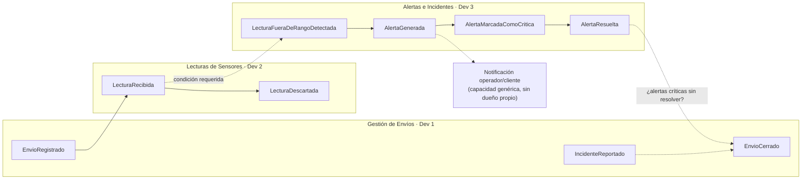

# Notas de equipo — Arranque del proyecto (DDD)

Event Storming informal, Bounded Contexts candidatos y asignación de subdominios para el sistema de cadena de frío.

## 2. Event Storming informal

### 2.1 Lista de eventos de dominio, en orden cronológico

Recorrimos cada historia de usuario y anotamos qué evento de dominio produce, en pasado:

| # | Evento | Origen | Nota |
|---|---|---|---|
| 1 | **EnvioRegistrado** | HU-01 | Fija la condición requerida (rango de temperatura y humedad). No modificable una vez iniciado el transporte (regla de negocio). |
| 2 | **LecturaRecibida** | HU-02 | El sensor IoT envía continuamente temperatura y humedad del contenedor. |
| 2a | **LecturaDescartada** | Regla de negocio | Camino alterno de (2): una lectura sin envío asociado se descarta. |
| 3 | **LecturaFueraDeRangoDetectada** | HU-03 | Evento pivote (ver 1.2). |
| 4 | **AlertaGenerada** | HU-03 | Debe ocurrir en menos de 5 minutos desde la lectura (criterio de aceptación). |
| 5 | **AlertaMarcadaComoCritica** | HU-03 | Cuando varias lecturas seguidas están fuera de rango. |
| 6 | **OperadorNotificado** | HU-04 | Notificación en tiempo real de la alerta. |
| 7 | **ClienteNotificado** | HU-05 | Misma alerta, para que el cliente decida (rechazar/aceptar con reserva). |
| 8 | **AlertaResuelta** | Supuesto | Necesaria para que la regla de HU-08 tenga sentido. |
| 9 | **IncidenteReportado** | HU-09 | Puede ocurrir en cualquier punto del transporte, no solo al cierre. |
| 10 | **EnvioCerrado** | HU-08 | Evento pivote (ver 1.2). Bloqueado si hay alertas críticas sin resolver. |

**HU-06 y HU-07 no son eventos.** "Consultar historial de lecturas" y "consultar estado/ubicación actual" son consultas de solo lectura 

### 2.2 Eventos pivote

- **LecturaFueraDeRangoDetectada.** No lo puede resolver un solo objeto: necesita la Lectura que llega del Sensor **y** la Condición requerida que vive en el Envío. Es la costura entre "vigilar sensores" y "vigilar condiciones del envío" — de aquí nace el límite entre Telemetría y Alertas.

- **EnvioCerrado.** Cambia quién es responsable de lo que sigue: Envíos no puede decidir el cierre por sí solo, depende de una respuesta del subdominio de Alertas ("¿hay alertas críticas sin resolver?"). Es la costura entre el ciclo de vida del Envío y la gestión de Alertas.

## 3. Bounded Contexts candidatos

| Bounded Context | Evento(s) pivote que lo originan | Por qué es un contexto propio |
|---|---|---|
| **Gestión de Envíos** | `EnvioCerrado` (lado que pregunta) | El Lenguaje Ubicuo gira en torno al Envío como raíz: condición requerida, incidentes, cierre. Puede evolucionar (p. ej. cambiar cómo se calcula el resumen de cumplimiento) sin tocar cómo se detectan alertas. |
| **Lecturas de Sensores (Telemetría)** | `LecturaFueraDeRangoDetectada` (lado que produce la lectura) | Aquí "lectura" significa un dato crudo de temperatura/humedad con marca de tiempo — un término distinto al "estado" que maneja Envíos. Es además el contexto de mayor volumen, lo que justifica que escale y se despliegue de forma independiente. |
| **Alertas e Incidentes** | `LecturaFueraDeRangoDetectada` (lado que consume) y `EnvioCerrado` (lado que responde) | Concentra la regla de "severidad" (normal/crítica) y el ciclo de vida de una Alerta (generada → notificada → resuelta), que no pertenece ni a Sensores ni a Envíos por separado. |

**Notificaciones no se propone como Bounded Context con dueño propio.** No tiene entidades ni Lenguaje Ubicuo propio (solo reenvía `AlertaGenerada` a operador/cliente) — es una capacidad genérica consumida desde Alertas.

## 4. Asignación de subdominios

| Integrante | Subdominio | Raíz del Agregado | Value Object candidato | Servicio de Dominio candidato |
|---|---|---|---|---|
| **Andres Daza** | Envíos y condiciones | `Envio` | `RangoTemperatura` — valida mínimo < máximo | `CierreEnvioService` — no cierra un envío con alertas críticas sin resolver |
| **Reynel Fabricio** | Lecturas de sensores | `Sensor` | `Lectura` — se descarta si no tiene envío asociado | `DeteccionFueraDeRangoService` — compara la lectura contra la condición requerida del envío |
| **Tomás Useche** | Alertas e incidentes | `Alerta` | `SeveridadAlerta` — normal/crítica según lecturas consecutivas | `EscalamientoAlertaService` — marca crítica cuando varias lecturas seguidas están fuera de rango |

## 4. Diagrama — Bounded Context events

