# Diagrama C4 — Sistema de Cadena de Frío (G6)

Este documento describe la **arquitectura objetivo** del sistema: el diseño hacia el que convergen las entregas progresivas del curso (hexagonal, microservicios, CQRS, EDA, saga, persistencia políglota). No es una implementación de una sola entrega — es el mapa completo sobre el que cada milestone del curso construye una porción.

## Por qué esta arquitectura

Los requisitos no funcionales del proyecto apuntan directamente a **EDA + microservicios + CQRS**, con **DDD/hexagonal** dentro de cada servicio:

| Requisito no funcional | Decisión arquitectónica |
|---|---|
| Alto volumen sostenido de eventos de sensores | Bus de eventos (Kafka) como columna vertebral; ingesta desacoplada del procesamiento |
| Alertas casi en tiempo real (<5 min, HU-03) | Procesamiento por stream sobre el topic de lecturas, sin batch |
| No perder lecturas aunque falle un componente | Kafka como log durable y reproducible; consumidores retoman desde su offset |
| Escalar contenedores/sensores sin rediseñar | Servicios desacoplados por eventos, escalado horizontal independiente por contenedor |
| Cierre de envío no puede tener alertas críticas sin resolver (HU-08) | Saga orquestada entre el contexto de Envíos y el de Alertas |
| Historial de lecturas vs. consultas de estado/dashboard (HU-06, HU-07) | CQRS: escritura de alto volumen separada del modelo de lectura |

## Bounded contexts

| Contexto | Entidades del dominio | Historias de usuario |
|---|---|---|
| Gestión de Envíos | Envío, Condición requerida | HU-01, HU-08, HU-09 |
| Telemetría / Ingesta | Sensor, Lectura | HU-02, HU-06, HU-07 |
| Detección de Alertas | Alerta | HU-03 |
| Notificaciones | — | HU-04, HU-05 |

## C1 — Diagrama de Contexto

## C2 — Diagrama de Contenedores

```mermaid
C4Container
    title Diagrama de Contenedores - Sistema de Cadena de Frío (G6)

    Person(operador, "Operador logístico")
    Person(cliente, "Cliente")
    Person(conductor, "Conductor / transportista")
    System_Ext(sensorIot, "Sensor IoT")
    System_Ext(notif, "Gateway de Notificaciones")

    System_Boundary(sistema, "Sistema de Cadena de Frío") {
        Container(webApp, "Portal Web", "SPA (React/Angular)", "Dashboard de envíos, alertas e historial para operador y cliente")
        Container(mobileApp, "App Móvil Conductor", "React Native / Flutter", "Consulta del envío asignado en ruta")
        Container(apiGateway, "API Gateway", "Spring Cloud Gateway", "Enrutamiento, autenticación y agregación para los clientes externos")

        Container(ingestion, "Servicio de Ingesta", "Spring Boot", "Recibe lecturas del broker MQTT y las publica en el bus de eventos")
        Container(shipmentSvc, "Servicio de Envíos", "Spring Boot (hexagonal)", "Ciclo de vida del envío, condiciones requeridas, incidentes, saga de cierre")
        Container(alertSvc, "Servicio de Detección de Alertas", "Spring Boot (stream processor)", "Evalúa cada lectura contra la condición requerida y genera alertas")
        Container(notifSvc, "Servicio de Notificaciones", "Spring Boot", "Despacha alertas a operador y cliente en tiempo real")
        Container(queryApi, "Servicio de Consultas", "Spring Boot", "Lado de lectura CQRS: historial, estado actual, dashboards")

        ContainerQueue(broker, "Bus de Eventos", "Apache Kafka", "LecturaRecibida, AlertaGenerada, EnvioRegistrado, EnvioCerrado")
        ContainerQueue(mqtt, "Broker MQTT", "EMQX / Mosquitto", "Punto de entrada de telemetría IoT")

        ContainerDb(shipmentDb, "BD Envíos", "PostgreSQL", "Envíos, condiciones requeridas, incidentes")
        ContainerDb(alertDb, "BD Alertas", "PostgreSQL", "Alertas y su estado de resolución")
        ContainerDb(tsDb, "BD Series de Tiempo", "TimescaleDB / InfluxDB", "Histórico de lecturas de sensores")
    }

    Rel(operador, webApp, "Usa", "HTTPS")
    Rel(cliente, webApp, "Usa", "HTTPS")
    Rel(conductor, mobileApp, "Usa", "HTTPS")
    Rel(sensorIot, mqtt, "Publica lecturas", "MQTT")

    Rel(webApp, apiGateway, "Llama", "HTTPS/JSON")
    Rel(mobileApp, apiGateway, "Llama", "HTTPS/JSON")

    Rel(apiGateway, shipmentSvc, "Registra/cierra envíos, reporta incidentes", "HTTPS/JSON")
    Rel(apiGateway, queryApi, "Consulta historial, estado, dashboards", "HTTPS/JSON")

    Rel(mqtt, ingestion, "Entrega lecturas", "MQTT")
    Rel(ingestion, broker, "Publica LecturaRecibida", "Kafka")
    Rel(ingestion, tsDb, "Persiste lectura cruda", "Write API")

    Rel(broker, alertSvc, "Consume LecturaRecibida", "Kafka")
    Rel(alertSvc, shipmentDb, "Lee condición requerida del envío", "JDBC")
    Rel(alertSvc, alertDb, "Persiste alerta", "JDBC")
    Rel(alertSvc, broker, "Publica AlertaGenerada", "Kafka")

    Rel(broker, notifSvc, "Consume AlertaGenerada", "Kafka")
    Rel(notifSvc, notif, "Envía notificación", "HTTPS/API")

    Rel(shipmentSvc, shipmentDb, "Lee/escribe", "JDBC")
    Rel(shipmentSvc, broker, "Publica EnvioRegistrado / EnvioCerrado", "Kafka")
    Rel(shipmentSvc, alertDb, "Verifica alertas críticas sin resolver (saga de cierre)", "JDBC/API")

    Rel(broker, queryApi, "Consume eventos y actualiza vistas de lectura", "Kafka")
    Rel(queryApi, tsDb, "Lee histórico", "SQL")
    Rel(queryApi, shipmentDb, "Lee estado de envíos", "SQL")
    Rel(queryApi, alertDb, "Lee alertas", "SQL")

    UpdateLayoutConfig($c4ShapeInRow="4", $c4BoundaryInRow="1")
```

## Notas de renderizado

- GitHub y VS Code (extensión *Markdown Preview Mermaid Support* o *Mermaid Chart*) renderizan `C4Context`/`C4Container` de forma nativa.
- Si el destino final es un documento entregable (Word/PDF), exportar cada diagrama como imagen (p. ej. con [mermaid.live](https://mermaid.live)) y referenciarla en el `.md`, en vez de depender del render del visor.
