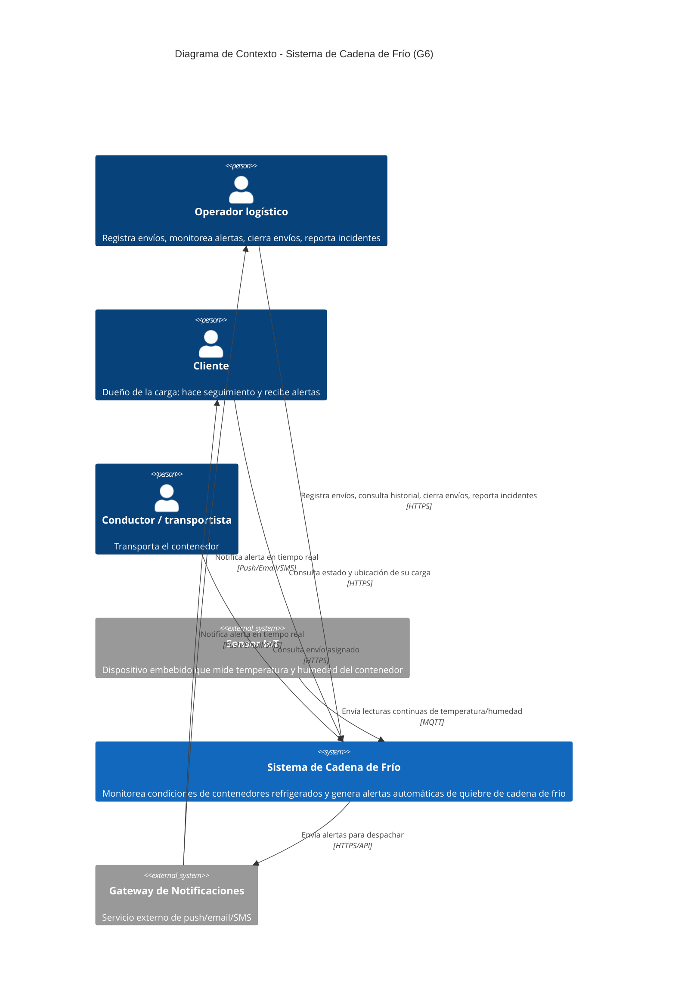
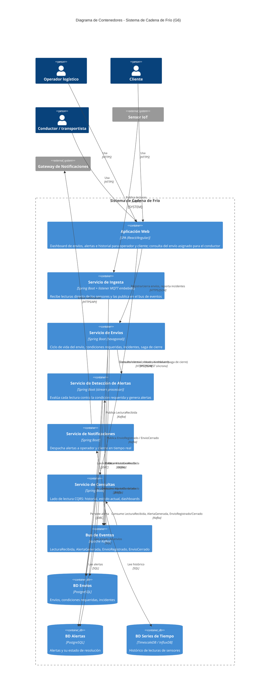
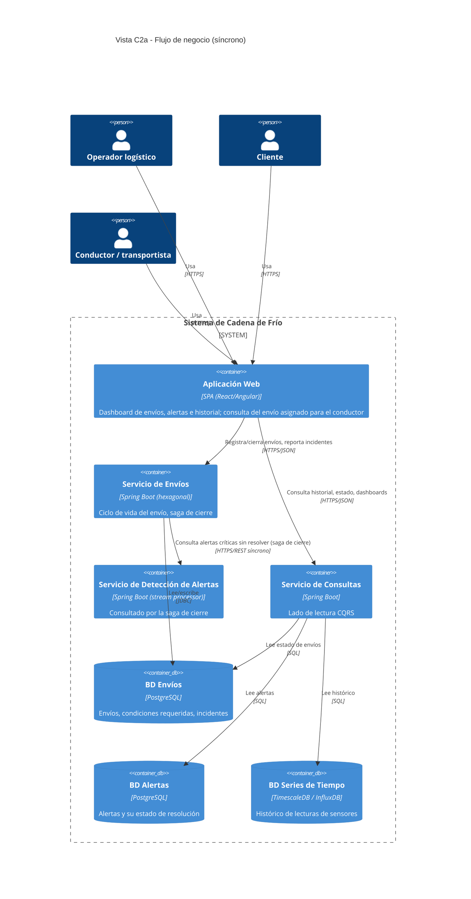
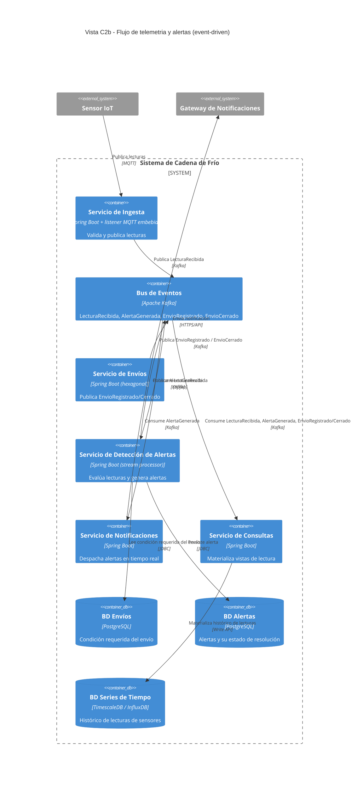

# Diagrama C4 — Sistema de Cadena de Frío (G6)

Este documento describe la **arquitectura objetivo** del sistema: el diseño hacia el que convergen las entregas progresivas del curso (hexagonal, microservicios, CQRS, EDA, saga, persistencia políglota). No es una implementación de una sola entrega — es el mapa completo sobre el que cada milestone del curso construye una porción.

## Por qué esta arquitectura

Los requisitos no funcionales del proyecto apuntan directamente a **EDA + microservicios + CQRS**, con **DDD/hexagonal** dentro de cada servicio:

| Requisito no funcional | Decisión arquitectónica |
|---|---|
| Alto volumen sostenido de eventos de sensores | Bus de eventos (Kafka) como columna vertebral; ingesta desacoplada del procesamiento |
| Alertas casi en tiempo real (<5 min, HU-03) | Procesamiento por stream sobre el topic de lecturas, sin batch |
| No perder lecturas aunque falle un componente | Kafka como log durable y reproducible; consumidores retoman desde su offset |
| Escalar contenedores/sensores sin rediseñar | Servicios desacoplados por eventos, escalado horizontal independiente por contenedor |
| Cierre de envío no puede tener alertas críticas sin resolver (HU-08) | Saga orquestada entre el contexto de Envíos y el de Alertas |
| Historial de lecturas vs. consultas de estado/dashboard (HU-06, HU-07) | CQRS: escritura de alto volumen separada del modelo de lectura |

## Bounded contexts

| Contexto | Entidades del dominio | Historias de usuario |
|---|---|---|
| Gestión de Envíos | Envío, Condición requerida | HU-01, HU-08, HU-09 |
| Telemetría / Ingesta | Sensor, Lectura | HU-02, HU-06, HU-07 |
| Detección de Alertas | Alerta | HU-03 |
| Notificaciones | — | HU-04, HU-05 |

> **Supuesto de diseño — rol Conductor.** `Requisitos_G6.md` lista "Conductor / transportista" como actor en la narrativa, pero ninguna de las 9 HU está escrita desde su punto de vista (todas son del Operador logístico, el Sensor IoT, el Sistema o el Cliente). Que el conductor consulte su envío asignado desde la misma **Aplicación Web** que usan operador y cliente es una inferencia razonable, no un requisito explícito — queda pendiente confirmar su alcance real con el asesor/docente antes de comprometerlo en una entrega.

## C1 — Diagrama de Contexto

## C2 — Diagrama de Contenedores (vista completa)

Versión simplificada para el alcance de un proyecto universitario: **una sola aplicación de usuario** (operador, cliente y conductor comparten la misma app web — no hay app móvil separada) y **sin API Gateway como contenedor propio**: la app web llama directamente a los dos servicios con los que interactúa una persona (Envíos y Consultas). El broker MQTT tampoco es un contenedor aparte — se modela como el listener MQTT embebido del Servicio de Ingesta, que es la única pieza que le habla a los sensores. Quedan 9 contenedores: 1 de interfaz, 4 servicios de dominio, el bus de eventos y 3 bases de datos.

Aun así, Kafka concentra 6 relaciones y mezcla el flujo síncrono (persona → app web → servicio) con el asíncrono (sensor → Kafka → consumidores), así que para lectura y presentación conviene usar las dos vistas enfocadas de C2a/C2b — el mismo modelo separado por pregunta ("¿cómo interactúa una persona?" vs. "¿cómo se convierte una lectura en una alerta?").

## C2a — Vista: Flujo de negocio (síncrono)

Responde "¿cómo interactúa una persona con el sistema?": operador, cliente y conductor usan la misma app web, que llama directo a los servicios de Envíos y Consultas. Incluye la llamada síncrona de la saga de cierre (`shipmentSvc → alertSvc`).

## C2b — Vista: Flujo de telemetría y alertas (event-driven)

Responde "¿cómo se convierte una lectura de sensor en una alerta notificada?": desde el sensor hasta la notificación, todo mediado por el bus de eventos. El sensor le habla directo al Servicio de Ingesta por MQTT (sin broker MQTT como contenedor aparte).

## Notas de renderizado

- GitHub y VS Code (extensión *Markdown Preview Mermaid Support* o *Mermaid Chart*) renderizan `C4Context`/`C4Container` de forma nativa.
- Si el destino final es un documento entregable (Word/PDF), exportar cada diagrama como imagen (p. ej. con [mermaid.live](https://mermaid.live)) y referenciarla en el `.md`, en vez de depender del render del visor.
- Si el diagrama de vista completa (C2) sigue viéndose con muchos cruces en tu editor, prueba bajar `$c4ShapeInRow` a `3` y observar el resultado en vivo — el layout de Mermaid es heurístico, así que a veces hay que iterar el valor manualmente. Para lectura y presentación, las vistas C2a/C2b son la alternativa recomendada.

## Verificación contra la guía del mini-curso C4

Contrastado contra la síntesis de [MD/Guías y Material del Docente/Guía · Mini-curso_ El modelo C4 para documentar arquitectura de software.md](<../../MD/Guías y Material del Docente/Guía · Mini-curso_ El modelo C4 para documentar arquitectura de software.md>), usando el checklist de la sección 7 (errores comunes):

- [x] Toda relación tiene verbo + tecnología entre corchetes cuando aporta valor (corregido: las dos relaciones `notif → operador/cliente` en C1 no tenían tecnología; se añadió `[Push/Email/SMS]`).
- [x] Todo rol humano (operador, cliente, conductor) usa `Person`, nunca notación de sistema.
- [x] El nivel de Contexto (C1) no expone ningún contenedor ni tecnología interna — Kafka, MQTT, PostgreSQL y TimescaleDB solo aparecen desde C2 en adelante.
- [x] Cada nivel responde solo su propia pregunta de zoom: C1 no descompone el sistema, C2 no entra a un solo contenedor (eso sería C3, aún no generado).
- [x] Notación limitada al set que enseña la guía (`Person`, `System`/`System_Ext`, `Container`, `ContainerDb`, `Rel`) — se reemplazaron los `ContainerQueue` de Kafka/MQTT por `Container` simple, ya que el ejemplo propio del mini-curso (`Servicio de notificaciones [Contenedor: Cola + workers]`) modela colas como contenedor normal con la tecnología en el rótulo, no como una forma aparte.

No se generó todavía el nivel de Componentes (C3) ni las vistas complementarias (Despliegue, Dinámico) — quedan pendientes si se necesitan para una entrega específica.

## Correcciones de diseño aplicadas

**1. Doble escritura en el Servicio de Ingesta.** Antes, Ingesta escribía la lectura cruda en la BD de series de tiempo **y** publicaba el evento en Kafka — dos escrituras independientes con riesgo de inconsistencia si el proceso fallaba entre una y otra. Se corrigió a **un solo escritor**: Ingesta únicamente publica `LecturaRecibida` en Kafka; el Servicio de Consultas (dueño del lado de lectura en CQRS) materializa esa lectura en la BD de series de tiempo al consumir el evento. Kafka queda como única fuente de verdad del flujo de lecturas — coherente con el NFR de "no perder lecturas aunque falle un componente".

**2. Acceso directo de Envíos a la base de datos de Alertas.** Antes, la verificación de "alertas críticas sin resolver" en la saga de cierre (HU-08) se modeló como `shipmentSvc` leyendo `alertDb` por JDBC — rompe el principio de que cada microservicio es dueño exclusivo de su base de datos, y acopla el esquema interno de Alertas a Envíos. Se corrigió a una **llamada síncrona de servicio a servicio** (`shipmentSvc → alertSvc` por REST): Envíos le pregunta a Alertas por su API, no por su base de datos. Queda como alternativa válida a futuro un enfoque coreografiado (Alertas publica eventos de resolución/generación, y Envíos mantiene una vista local de "alertas críticas abiertas por envío"), que evitaría la dependencia síncrona entre ambos servicios a costa de una consistencia con más retraso — no se aplicó todavía por ser más compleja de razonar para esta etapa del proyecto.

**3. Pendiente — lecturas SQL directas del Servicio de Consultas a `shipmentDb`/`alertDb`.** El mismo problema del punto 2 aparece en `queryApi → shipmentDb` y `queryApi → alertDb`: es lectura, no escritura, así que es más tolerable (patrón común de "reporting reads" en CQRS), pero sigue acoplando `queryApi` al esquema interno de otros servicios. La corrección consistente sería que Envíos y Alertas también publiquen eventos de cambio de estado (harían falta, p. ej., `AlertaResuelta`) y que `queryApi` materialice su propia copia de envíos y alertas igual que ya hace con las lecturas — eliminando toda lectura SQL cruzada entre servicios. No aplicada todavía, pendiente de decisión.

**4. Simplificación del C2 al alcance de un proyecto universitario.** El C2 original tenía 13 contenedores: app web, app móvil de conductor, API Gateway, broker MQTT y 9 más. Para un equipo de curso eso es más infraestructura de la que conviene sostener sin diluir el foco en los patrones que sí son objeto de evaluación (EDA, microservicios, CQRS, saga, DDD/hexagonal). Se simplificó a 9 contenedores sin renunciar a ningún patrón arquitectónico: **(a)** una sola **Aplicación Web** para operador, cliente y conductor — no hay justificación en las HU para dos clientes distintos; **(b)** sin **API Gateway** como contenedor propio — con un único cliente y solo dos servicios expuestos (Envíos, Consultas), el gateway no resuelve un problema real a esta escala, la app web les llama directo; **(c)** sin **broker MQTT** como contenedor propio — se modela como el listener MQTT embebido del Servicio de Ingesta, que sigue siendo el único punto de entrada de telemetría. Si el proyecto crece (más tipos de cliente, más servicios detrás del gateway), estas piezas se reintroducen sin tocar el resto del modelo.
