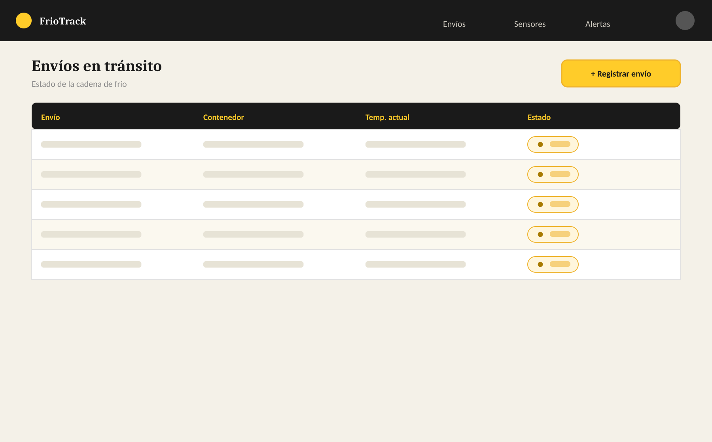
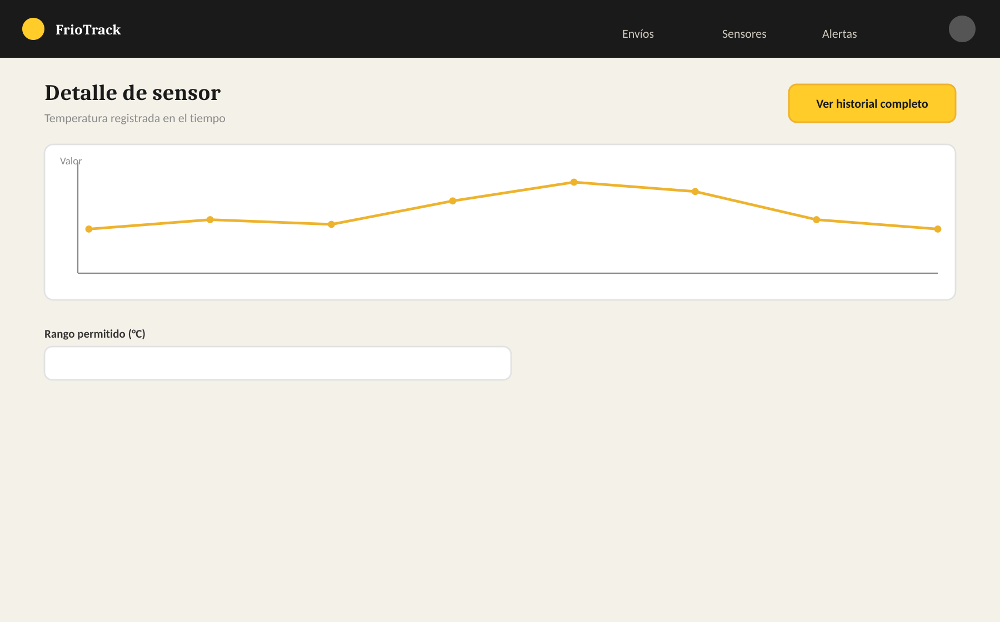

# Semana 1 · Proyecto G6

**Ingeniería de Software II — Cadena de frío / logística con sensores IoT**

Requisitos ya levantados para este proyecto — el tiempo del curso se dedica a diseñar e implementar arquitectura, no a elicitar requisitos.

> **Alcance de este documento:** Historias de usuario, reglas de negocio, requisitos no funcionales, entidades clave y un boceto de interfaz para arrancar. Implementan todas las arquitecturas que se expliquen en clase, sobre este mismo dominio — no hay una arquitectura "asignada" al proyecto. Pueden refinar el detalle con su asesor a medida que avanzan.

## 1. Narrativa

Sistema para monitorear temperatura y humedad de contenedores refrigerados durante el transporte de mercancía sensible, generando alertas automáticas cuando se rompe la cadena de frío.

**Actores**

- Operador logístico
- Sensor IoT (dispositivo)
- Conductor / transportista
- Cliente (dueño de la carga)

## 2. Historias de usuario

- **HU-01.** Como operador logístico, quiero registrar un envío con sus condiciones requeridas (rango de temperatura y humedad), para definir qué se considera una falla.
- **HU-02.** Como sensor IoT, quiero enviar continuamente lecturas de temperatura y humedad del contenedor, para que el sistema pueda vigilar la carga.
- **HU-03.** Como sistema, quiero detectar automáticamente una lectura fuera de rango, para reaccionar sin depender de que alguien esté monitoreando manualmente.
  - Criterio de aceptación: una lectura fuera de rango genera una alerta en menos de 5 minutos.
  - Criterio de aceptación: si varias lecturas seguidas están fuera de rango, la alerta se marca como crítica.
- **HU-04.** Como operador logístico, quiero recibir una notificación en tiempo real ante una alerta de quiebre de cadena de frío, para actuar de inmediato.
- **HU-05.** Como cliente, quiero recibir esa misma alerta sobre mi carga, para tomar decisiones (rechazar, aceptar con reserva).
- **HU-06.** Como operador logístico, quiero consultar el historial completo de lecturas de un envío, para usarlo como evidencia ante un reclamo.
- **HU-07.** Como cliente, quiero consultar el estado y ubicación actual de mi envío en curso, para hacer seguimiento.
- **HU-08.** Como operador logístico, quiero cerrar un envío al llegar a destino con un resumen de cumplimiento de condiciones, para dejar constancia formal.
  - Criterio de aceptación: un envío no puede cerrarse si tiene alertas críticas sin resolver.
- **HU-09.** Como operador logístico, quiero reportar incidentes por envío, para documentar causas de una posible falla.

## 3. Reglas de negocio

- Toda lectura fuera de rango debe generar una alerta antes de 5 minutos.
- Un envío no puede cerrarse con alertas críticas sin resolver.
- La condición requerida de un envío no puede modificarse una vez iniciado el transporte.
- Una lectura sin envío asociado se descarta.

## 4. Requisitos no funcionales

- Alto volumen de eventos de sensores — el sistema debe procesar ese flujo de forma sostenida.
- Las alertas de quiebre de cadena deben generarse y notificarse casi en tiempo real.
- No pueden perderse lecturas de sensores aunque un componente falle temporalmente — son evidencia para reclamos.
- Debe poder escalar el número de contenedores y sensores monitoreados sin rediseñar el sistema.

## 5. Entidades clave del dominio

Envío · Contenedor · Sensor · Lectura · Alerta · Condición requerida

## 6. Boceto de interfaz (baja fidelidad)

Punto de partida visual — no es diseño final, es para arrancar con una idea concreta de pantallas.

**Envíos en tránsito**

**Detalle de sensor con histórico de temperatura**

